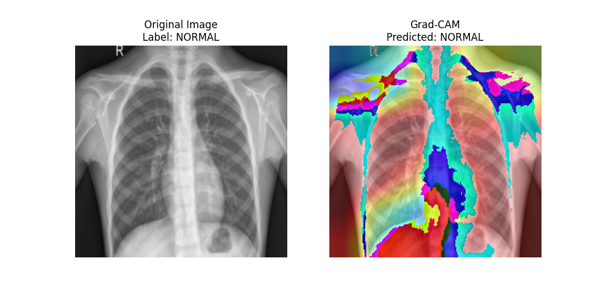

# Pneumonia Detection from Chest X-rays using DenseNet121 with SE Blocks

  
*Contoh visualisasi Grad-CAM pada prediksi pneumonia*

## 📌 Deskripsi Proyek
Repository ini berisi implementasi model **DenseNet121 yang diperkuat dengan Squeeze-and-Excitation (SE) Blocks** untuk deteksi pneumonia dari gambar X-ray dada. Model ini mencapai **akurasi 83.8%** dengan kemampuan interpretasi menggunakan Grad-CAM.

Fitur Utama:
- 🏗️ Arsitektur hybrid DenseNet121 + SE Blocks
- ⚖️ Penanganan class imbalance dengan weighted loss
- ✂️ Model pruning untuk optimasi
- 🔍 Interpretasi prediksi dengan Grad-CAM
- 🎯 Evaluasi menggunakan 5-fold cross validation

## 📂 Struktur Direktori
chest-xray-pneumonia/
├── data/
│ ├── train/
│ │ ├── NORMAL/
│ │ └── PNEUMONIA/
│ ├── val/
│ └── test/
├── outputs/
│ ├── confusion_matrix.png
│ ├── training_curves.png
│ └── gradcam_*.png
├── models/
│ └── best_pneumonia_model.pth
├── pneumonia_detection.ipynb
└── README.md


## 🛠️ Instalasi
1. Clone repository:
   ```bash
   git clone https://github.com/[username]/pneumonia-detection.git
   cd pneumonia-detection
Install dependencies:

bash
pip install -r requirements.txt
(Lihat section Requirements untuk detail paket)

Download dataset:

Otomatis via Kaggle API (termasuk dalam kode)

Manual: Dataset Chest X-Ray Images (Pneumonia)

🚀 Cara Menjalankan
Jalankan notebook utama:

bash
jupyter notebook pneumonia_detection.ipynb
Atau eksekusi via Python:

bash
python train.py
📊 Hasil Evaluasi
Metrics (Pada Test Set)
Class	Precision	Recall	F1-Score
NORMAL	98.5%	57.7%	73%
PNEUMONIA	79.7%	99.5%	88%
Accuracy	83.8%		
Visualisasi
Confusion Matrix
Training Curves

🧠 Arsitektur Model
python
class EnhancedDenseNet(nn.Module):
    def __init__(self):
        super().__init__()
        self.densenet = models.densenet121(pretrained=True)
        self.se_blocks = nn.ModuleDict({
            'se1': SEBlock(256),
            'se2': SEBlock(512),
            'se3': SEBlock(1024)
        })
        # ... (full implementation in code)
💡 Teknik Khusus yang Digunakan
Squeeze-and-Excitation Blocks
Meningkatkan channel-wise feature recalibration

python
class SEBlock(nn.Module):
    def forward(self, x):
        b, c, _, _ = x.size()
        y = self.pool(x).view(b, c)
        y = self.fc(y).view(b, c, 1, 1)
        return x * y  # Recalibrated features
Pruning Model
Mengurangi parameter tidak penting:

python
prune.l1_unstructured(module, name='weight', amount=0.3)
Grad-CAM Visualization
Menunjukkan area kritis untuk prediksi:

python
heatmap = torch.mean(activations, dim=1).squeeze()
📝 Requirements
Dependencies utama:

torch==2.0.1
torchvision==0.15.2
scikit-learn==1.2.2
matplotlib==3.7.1
kagglehub==0.1.6
opencv-python==4.7.0.72
Install semua dependencies:

bash
pip install -r requirements.txt
🤝 Kontribusi
Kontribusi dipersilakan! Ikuti langkah:

Fork project

Buat branch baru (git checkout -b fitur-baru)

Commit perubahan (git commit -m 'Tambahkan fitur')

Push ke branch (git push origin fitur-baru)

Buat Pull Request

📜 Lisensi
Proyek ini dilisensikan di bawah MIT License.